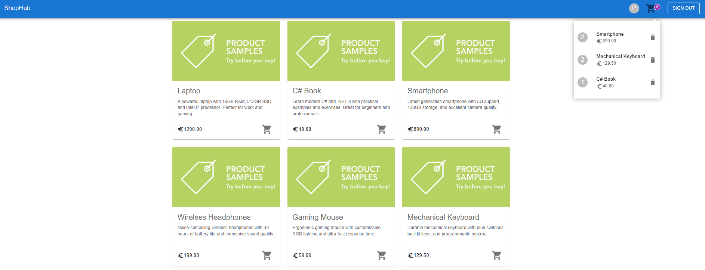

# ShopHub

Practical assignment from YamSoft for the role of Full Stack Developer (.NET + React)

## Technologies

* ASP.NET Core Web API
* Entity Framework Core
* Automapper
* React 18+ with React Router
* Redux
* UI with MUI (Material UI)
* TypeScript

Run the following command to seed the database with products:

```
Update-Database
```

Configure environment variables: create a `.env` file at the root of the project and add the following:
```
VITE_AUTH_API_URL=http://localhost:5041/api
VITE_PRODUCTS_API_URL=http://localhost:5041/api/products
```

To run FE project:
```
npm install
npm run dev
```

Controllers → Cache Services (Decorator Pattern) → Data Services → Repos; DTOs; mapping

## Preview

